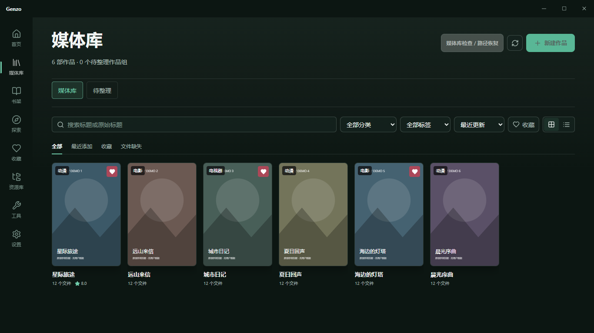
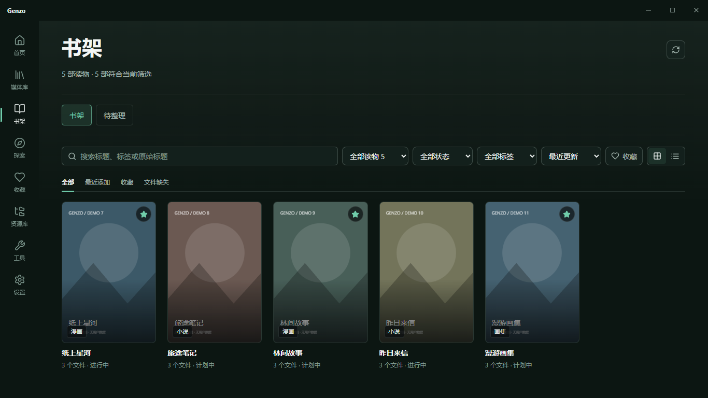
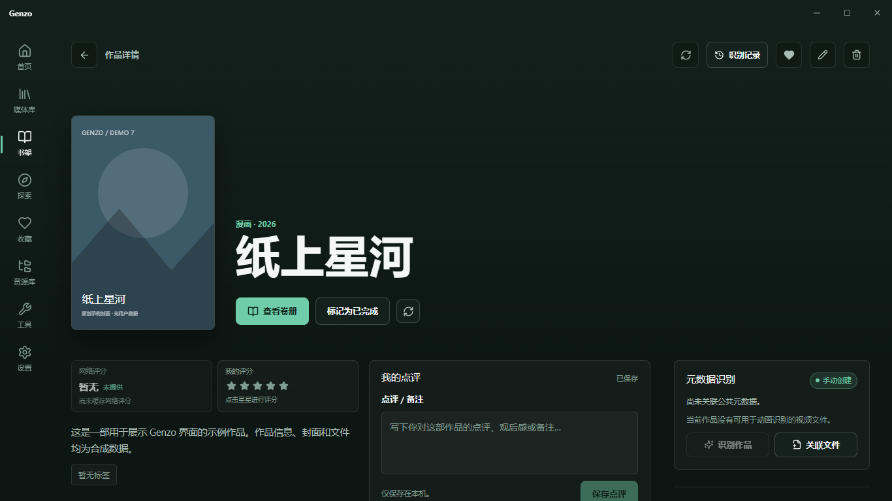
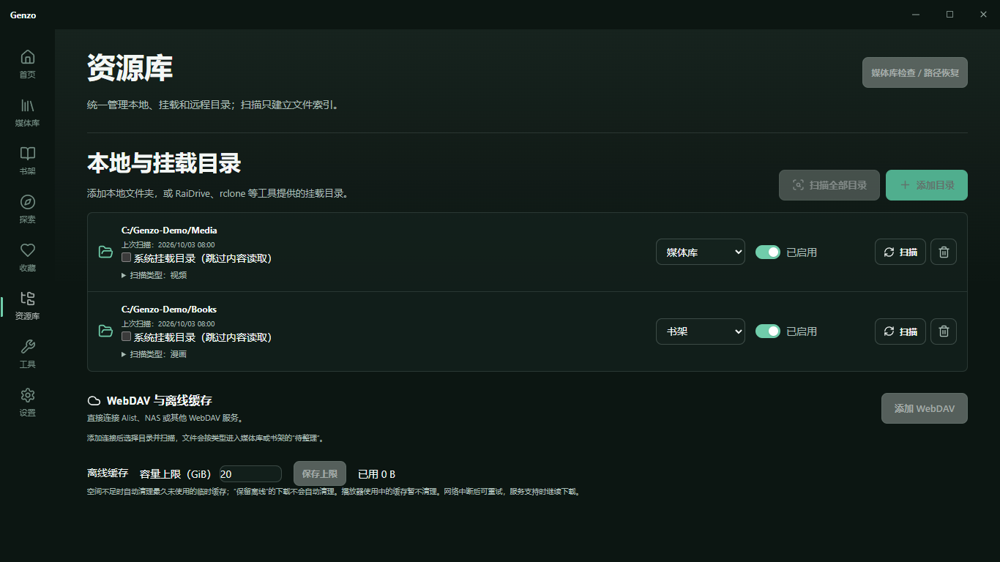

# Genzo

**你的私人次元媒体库。** Genzo 是 Windows 优先、本地优先的 ACGN 管理工具，把自己的动漫、电影、电视剧、漫画、小说和游戏整理成可浏览的作品库，保存收藏、评分、笔记与观看 / 阅读状态，并调用你熟悉的播放器或阅读器。

适合已有本地文件、NAS 或 WebDAV 目录，希望整理作品、分集和卷册的用户。扫描和归档建立本地索引；不会替你改名、移动或删除原始媒体文件。

## 下载与安装

**当前正式版：Windows x64 v0.5.0。安卓版本尚未交付。**

`codex/personal-sync-v1` 分支另提供 **0.6.0-alpha.1 个人 WebDAV 同步测试版**，已有共用 Rust 核心和 Windows 验证入口，尚未正式发布。测试版使用独立数据目录，不覆盖正式版资料；安装包、使用步骤和验证边界见 [同步 V1 验证记录](docs/SYNC_V1_VALIDATION.md)。安卓客户端接入和阿里云实际部署仍待验证。

- [下载安装器 Genzo_0.5.0_x64-setup.exe](https://github.com/Boringchen-10/genzo/releases/download/v0.5.0/Genzo_0.5.0_x64-setup.exe)
- [发行说明与全部附件](https://github.com/Boringchen-10/genzo/releases/tag/v0.5.0)
- [SHA-256 校验文件](https://github.com/Boringchen-10/genzo/releases/download/v0.5.0/SHA256SUMS.txt)

1. 使用 Windows 10 / 11 **64 位**系统，下载上面的 `.exe`，双击并按安装向导操作。
2. 安装到当前 Windows 用户；安装完成后，从开始菜单或快捷方式启动 **Genzo**。
3. 安装器附带 x64 **WebView2 离线运行时安装程序**：检测到已有运行时会复用，缺失时安装。无需另外安装 Node.js、Rust 或 Android Studio，也无需为 WebView2 临时下载引导程序。读取联网元数据仍需要网络。
4. v0.5.0 安装包没有代码签名。若 Windows 提示未知发布者，请先核对下载来源和下方 SHA-256；干净系统的 SmartScreen 表现尚未自动验证。

下载后可在 PowerShell 执行以下命令，将结果与 `SHA256SUMS.txt` 比较：

```powershell
Get-FileHash .\Genzo_0.5.0_x64-setup.exe -Algorithm SHA256
```

播放器、阅读器和游戏本体需自行安装 / 准备，Genzo 安装包不包含这些工具。本版没有自动更新器，升级时请关闭 Genzo 后运行新安装包，沿用相同安装目录与 Windows 用户。旧库通过增量迁移升级；建议先备份本地数据，不要手动清库或降级运行旧程序。

## 界面预览

以下为 v0.5.0 实际前端界面，使用合成作品资料和原创示例封面，不包含用户文件或第三方作品素材。

| 媒体库 | 书架 |
| --- | --- |
|  |  |

| 作品详情 | 资源库 |
| --- | --- |
|  |  |

## v0.5.0 能做什么

| 模块 | 当前功能 |
| --- | --- |
| 资源库 | 管理本地、系统挂载与 WebDAV 目录；为目录选择媒体库 / 书架归属；扫描任务、取消、失败目录重试与增量扫描。 |
| 媒体库 | 动漫、电影、电视剧等作品的海报 / 列表、筛选和搜索；待整理、候选核对、分集及字幕关联、批量纠错与近期识别撤销。 |
| 书架 | 独立漫画 / 小说库及待整理目录；按文件名卷号建议整套归档；系列与 Bangumi 单册识别、逐卷封面、标题 / 卷号编辑、已读状态、多选和持久排序 / 拖动调位。 |
| 图片 | 按用途选择海报、背景和分集剧照；TMDB 多候选选图、高 DPI 原图选择、图片失败回退 / 重试；漫画探索封面缓存。 |
| 探索与收藏 | 动画本地标题索引、时间表与联网榜单；漫画资料搜索、筛选、点击展开和完整详情，可加入书架；收藏按动漫、电影、电视剧、漫画、小说、游戏筛选。 |
| 个人记录 | 收藏、我的评分、笔记、标签与状态；网络评分和个人评分分别展示，人工锁定资料受刷新保护。 |
| 外部工具 | 配置 / 检测播放器、阅读器与游戏启动工具；打开本地文件，支持模板参数。受支持的 PotPlayer 会话可记录位置与续播。 |
| 远程存储 | 用户自行配置的 WebDAV 目录浏览、索引、Range 转发播放、临时缓存与保留离线；挂载目录沿用本地流程。 |

**识别与格式的范围：**

- 动漫以 Bangumi 为主，随包附带 `bangumi-data` 标题索引；TMDB 和 AniList 在身份核对后补充视觉资料、评分或标签。电影 / 电视剧使用 TMDB，需配置自己的 **API Read Access Token**（不是 API Key），参见 [TMDB 官方说明](https://developer.themoviedb.org/docs/authentication-application)。
- 漫画 / 小说使用文件名、目录和 Bangumi 书籍资料；EPUB 的 OPF、CBZ / ZIP 的 ComicInfo 与内嵌封面可读取。CBR / RAR / 7z、PDF / TXT / MOBI / AZW3 等可以分类索引和交给外部工具，**不保证能提取内嵌资料或封面**。没有匹配资料时仍可手动建书。
- 漫画探索目前使用拷贝兼容的**作品资料目录**，Kira 仅作为接口适配参考；没有内置漫画章节阅读、账号登录或章节下载。该第三方目录不是已确认的官方开放 API，服务变化可能影响可用性；已有本地库和缓存仍可使用。
- PotPlayer 观看位置仅采集由 Genzo 调度、能够核对文件的受支持会话；从 Genzo 打开下一集或播放器内切到可唯一匹配的库内文件可继续记录。其他播放器和系统默认打开不自动记录位置，参见 [播放说明](docs/PLAYBACK.md)。
- 游戏目前支持本地记录与外部启动；VNDB / IGDB 刮削、跨设备同步、内置播放器 / 阅读器、安卓安装包仍属后续规划，见 [ROADMAP.md](ROADMAP.md)。界面中禁用的 Future 入口不代表功能已交付。

Genzo 不提供影视片源搜索、盗版资源聚合或媒体分发。远程存储只连接用户自行配置且有权访问的文件。

## 第一次使用

1. **资源库 → 添加目录**：选自己的文件夹，设置扫描类型和归属。影视选择“媒体库”，漫画 / 小说选择“书架”。RaiDrive、rclone 或网络盘目录可勾选“系统挂载目录”。WebDAV 使用“添加 WebDAV”，连接后逐级选择扫描文件夹。
2. **扫描**：等待任务完成。扫描只建立文件索引，暂未识别的内容出现在对应库的“待整理”。
3. **整理作品**：选择目录或文件，搜索 / 识别候选，核对名称、季度、集号或卷号后确认。书籍可按编号选择整套；模糊、重号和特别篇需人工核对，不必为每本单独建作品。
4. **工具 → 设置默认工具**：视频选择已安装的播放器，漫画 / 小说选择阅读器。打开作品详情后，从分集 / 卷册的“打开”进入相应工具。
5. **保存个人记录**：收藏、评分、笔记、阅读状态和自定义卷册顺序保存在本机。详情返回和鼠标侧键会回到进入前的子页面。

识别失败可以重试、手动搜索或手动创建作品；缺图可以重试图片或刷新元数据。没有网络时仍可浏览已整理本地库和打开本地文件。已有低清图片可在详情刷新元数据更新，最终画质取决于来源原图。

## 数据与升级

默认数据目录：`%APPDATA%\com.genzo.desktop`；默认安装目录：`%LOCALAPPDATA%\Genzo`。

- `genzo.db` 保存作品、文件索引、关联、个人记录和设置；`covers` / `thumbnails` 保存图片，`remote-cache` 保存远程缓存。
- **备份**：关闭 Genzo 后复制整个数据目录到私人位置；不要在运行时只复制 `genzo.db` 而忽略 WAL。恢复前同样关闭程序，并使用相同或更新版本。尚无跨设备账号同步和完整导出向导。
- WebDAV 密码保存于 **Windows 凭据管理器**，不会随数据库备份迁移到其他电脑；新电脑需重新保存连接凭据。TMDB Token 使用本机设置 / SQLite 存储，备份可能含密钥或私人信息，不要公开上传。
- SQLite 初始化 / 迁移失败会中止启动，不静默重建库。v0.5.0 已验证旧版本磁盘库升级、再次打开与个人数据保留；验证范围和人工检查项见 [发布验证记录](docs/RELEASE_V0.5.0.md)。
- 删除作品、目录配置或将卷册移出作品，只修改索引 / 关联；“清理缓存”处理应用生成的缓存，原始媒体文件保留。

## 源码开发与构建

普通使用者只需安装上面的 `.exe`。以下环境仅供开发者：Node.js 22+、pnpm 11.19.0、Rust stable MSVC、Visual Studio C++ Build Tools / Windows SDK，以及 WebView2。技术栈为 Tauri 2、React、TypeScript、Rust、SQLite / SQLx。

```powershell
pnpm install --frozen-lockfile
pnpm tauri dev

pnpm test
pnpm build
cargo test --locked --manifest-path src-tauri/Cargo.toml
cargo clippy --locked --manifest-path src-tauri/Cargo.toml --all-targets

# Windows x64 NSIS；直接调用 CLI 保留 Cargo 的 --locked 参数
node node_modules/@tauri-apps/cli/tauri.js build --bundles nsis -- --locked
```

默认安装器产物：`src-tauri/target/release/bundle/nsis/Genzo_<版本>_x64-setup.exe`；本开发分支版本为 0.6.0-alpha.1，正式下载仍为 v0.5.0。构建时需联网获取依赖 / WebView2 离线运行时；安装包内含运行时安装程序，用户无需构建工具。前端没有独立线上服务端，浏览器预览的模拟数据不等于真实桌面能力。

开始修改前阅读 [AGENTS.md](AGENTS.md)、[PROJECT_CONTEXT.md](PROJECT_CONTEXT.md)、[ROADMAP.md](ROADMAP.md)、[DESIGN_DIRECTION.md](DESIGN_DIRECTION.md) 和 [AI_HANDOFF.md](AI_HANDOFF.md)。安卓开发以 **v0.5.0 注释标签**固定 Windows 发布源码，兼容性审查见 [ANDROID_BASELINE_V0.5.0.md](docs/ANDROID_BASELINE_V0.5.0.md)，不混入该版本。

## 个人同步 V1 开发版

桌面同步不依赖 Android 客户端完成，也不必先安装测试包。接入本分支源码后，在项目目录运行 `pnpm tauri dev` 或 `pnpm dev:desktop`，进入桌面窗口的“设置 → 个人同步”即可使用真实能力。单独 `pnpm dev` 只运行 Vite 浏览器预览，不提供本机 SQLite、Windows 凭据库和 Rust 同步后端。

为一个人在多台设备间交换动漫、电影、电视剧的资料和个人记录。每台设备使用自己的 SQLite；WebDAV 只保存同步文档，不传媒体、运行中的数据库、本地路径、播放器配置或账号密码。首次加入先读取远端；并发笔记保留双方，删除记录、待上传修改与失败重试持久保存。

Windows 测试入口位于“设置 → 个人同步”，支持连接能力测试、创建 / 加入、立即同步、暂停 / 启用、更新凭据、冲突选择 / 合写和本地视频完整 SHA-256 版本确认。界面用于真实功能验证，正式界面等待 OpenDesign 确认。漫画、小说、游戏记录不在首版同步范围。

- [共用协议](docs/SYNC_PROTOCOL_V1.md)、[接口和样例](docs/sync-v1/interfaces.ts)、[共享核心](crates/genzo-sync)、[OpenDesign 能力与事件清单](docs/SYNC_UI_CAPABILITIES.md)。
- [Android 接入与联调顺序](docs/SYNC_ANDROID_INTEGRATION_V1.md)：复用同一核心，仍需 SAF、Keystore、生命周期和真实播放器接入。
- [WebDAV 部署文件](deploy/webdav/README.md)：Apache + Caddy、HTTPS、个人认证、持久目录及备份。未连接或修改实际阿里云服务器。

开发环境构建独立 Windows 测试安装器：

```powershell
node node_modules/@tauri-apps/cli/tauri.js build --config src-tauri/tauri.sync-test.conf.json --bundles nsis -- --locked
```

测试配置启用本机 WebView2 调试端口，仅用于开发验收，不能作为正式发布配置。v0.5.0 的标签、下载入口与安装器保持原样。

## 许可证与来源

Genzo 使用 [GPL-3.0-only](LICENSE)。第三方依赖、借鉴来源与许可证见 [THIRD_PARTY_NOTICES.md](THIRD_PARTY_NOTICES.md)；内置 `bangumi-data` 按 CC BY 4.0 署名。Genzo 使用 Bangumi、TMDB 与 AniList 等作品资料，不隶属于这些平台。

This product uses the TMDB API but is not endorsed or certified by TMDB.
